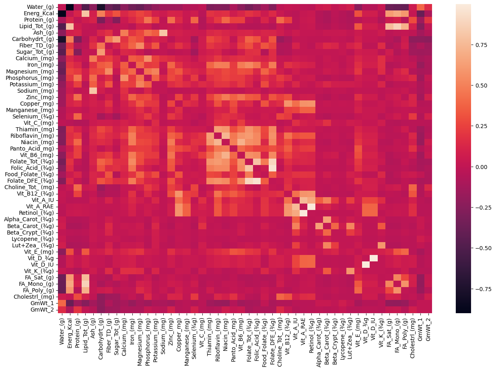
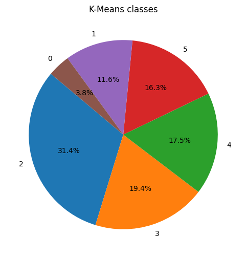
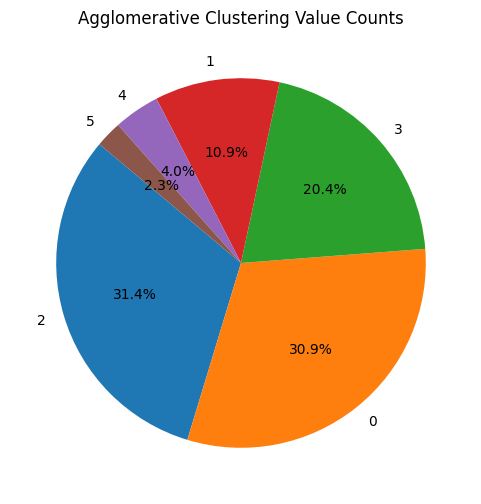
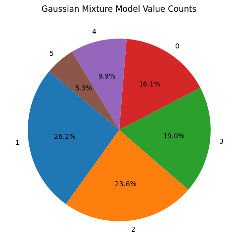
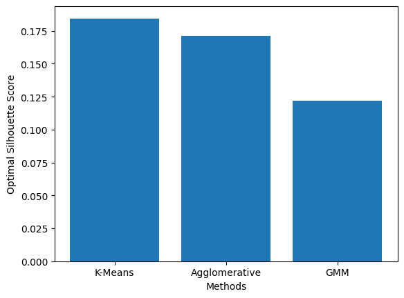

# Clustering by Nutrition
Location: [Github](https://github.com/kymayodeji/nutrition_clustering) 

Jupyter file: [Notebook](https://github.com/kymayodeji/nutrition_clustering/blob/main/Clustering.ipynb): 

Background Knowledge:
USDA Reference: https://www.ers.usda.gov/webdocs/publications/42215/5831_aib750b_1_.pdf

### Objective
As early as 1917, the US Department of Agriculture (USDA) has publicized different groupings of food to classify food products.  Currently there are six food groups that the USDA uses:
 1. Bread, cereal, rice, and pasta, 
 2. Vegetables,  
 3. Fruits, 
 4. Milk, yogurt, and cheeses, 
 5. Meat, poultry, fish, dry beans, eggs, and nuts and 
 6. Fats, oils, and sweets 
 These groups have been organized based on *"nutritional objectives and to moderate intake of those components related to risk of chronic diseases"* (Dietary Recommendations and How They Have Changed Over Time, Davis & Saltos). 

For this project, I am looking to determine if the current number of six food groups (last updated in 1993) is the optimal grouping based on nutritional similarities.  **The objective of the analysis is to determine an optimal model to cluster food groups based on nutritional data and verify that the same food products should remain grouped together.**  As many new food products have been developed since 1993, an updated grouping of the almost 9000 different food products can be used by nutritionists and dieticians to design updated meal plans based on nutritional needs and markers.

### Data
The United States Department of Agriculture Agricultural Research Service’s ([USDA](https://fdc.nal.usda.gov/)) Food composition database contains numerous food products and associated descriptions of their nutritions. This dataset is available on [Kaggle](https://www.kaggle.com/datasets/maheshdadhich/us-healthcare-data/?select=Nutritions_US.csv) and is the result of web scraping the USDA's website. The dataset had a size of 8,790 rows/observations and 51 columns where each row/observation represents a food product with the columns numerically representing the amount (per 100 grams) of the associated vitamin or mineral in the food product. Column names are self-explanatory names yet the descriptions can be found below. 

 We will be using this nutritional data to find an optimal clustering of food products based on nutritional similarities.
 **Column Names**
1. NDB_No - Nutrition database number
2. Shrt_Desc - Short description
3. Water_(g) - water in grams per 100 grams
4. Energy_Kcal - Energy in Kcal
5. Protein_(g) - Protein
6. Lipid_Tot_(g) - Total Lipid
7. Ash_(g) - Ash
8. Carbohydrt_(g) - Carbohydrate, by difference
9. Fiber_TD_(g) - Fiber, total dietary
10. Sugar_Tot_(g) - Total Sugars
11. Calcium_(mg) - Calcium
12. Iron_(mg) - Iron
13. Magnesium_(mg) - Magnesium
14. Phosphorus_(mg) - Phosphorus
15. Potassium_(mg) - Potassium
16. Zinc_(mg) - Zinc
17. Copper_(mg) - Copper
18. Manganese_(mg) - Manganese
19. Selenium_(æg) - Selenium
20. Vit_C_(mg) - Vitamin C, total ascorbic acid
21. Thiamin_(mg) - Thiamin
22. Riboflavin_(mg) - Riboflavin
23. Niacin_(mg) - Niacin
24. Panto_Acid_(mg) - Pantothenic acid
25. Vit_B6_(mg) - Vitamin B6
26. Folate_Tot_(æg) - Folate, total
27. Folic_Acid_(æg) - Folic acid
28. Food_Folate_(æg) - Folate, food
29. Folate_DFE_(æg) - Folate, DFE
30. Choline_Tot_ (mg) - Choline, total
31. Vit_B12_(æg) - Vitamin B-12
32. Vit_A_IU - Vitamin A, IU
33. Vit_A_RAE - Vitamin A, RAE
34. Retinol_(æg) - Retinol
35. Alpha_Carot_(æg) - Carotene, alpha
36. Beta_Carot_(æg) - Carotene, beta
37. Beta_Crypt_(æg) - Cryptoxanthin, beta
38. Lycopene_(æg) - Lycopene
39. Lut+Zea_ (æg) - Lutein + zeaxanthin
40. Vit_E_(mg) - Vitamin E (alpha-tocopherol)
41. Vit_D_æg - Vitamin D (D2 + D3)
42. Vit_D_IU - Vitamin D
43. Vit_K_(æg) - Vitamin K (phylloquinone)
44. FA_Sat_(g) - Fatty acids, total saturated
45. FA_Mono_(g) - Fatty acids, total monounsaturated
46. FA_Poly_(g) - Fatty acids, total polyunsaturated
47. Cholestrl_(mg) - Cholesterol
48. GmWt_1 - gram weight 1
49. GmWt_Desc1 gram weight 1 descriptions
50. GmWt_2 - gram weight 2
51. GmWt_Desc2 - gram weight 2 description

### Exploratory Data Analysis, Data Cleaning and Data Pre-Processing
I removed two columns (*49. GmWt_Desc1* and *51. GmWt_Desc2*) as they involved text descriptions that would not be useful in identifying nutritional values of the foods. The individual identifier column (*1. NDB_No*) was also removed for the same reason, but the *2. Short_Desc* column was kept for identification purposes after the clustering was performed. Almost all of the remaining columns had null/empty values, but that is not problematic as not all vitamins/minerals are present in a food project. I elected to replace the emtpy values with 0 to address the scenarios where there were missing values. 

Using a correlation matrix, we found very few pairings of the 47 features were strongly correlated to each other.

 Most of the feature distributions were strongly skewed, so a log transform was applied and then a feature scaling (normalization) applied to prepare the data for the clustering models.

### Methods
I used multiple clustering methods (KMeans, Hierarchical Agglomerative, and Gaussian Mixture Model) to cluster the data. To obtain the optimal number of clusters, I used hyperparameters to tune the various parameters  needed for each model. The Silhoutee score was the metric used to determine the optimal parameters to use during the Parameter Grid Search.

### Findings and Insights Summary

 Ultimately, I have decided that the K-Means method was the more reliable as it had the highest Silhouette score of the methods that listed six clusters as the optimal number of clusters.Although the K-Means method was faster to fit, the Hierarchical model is known to work well for large datasets such as the one we used (8000+ rows). Unfortunately, the result of hypertuning the Hierarchical Clustering resulted in an "optimal" result being the smallest number of clusters tested when using non-Ward linkage options. This also led to an extremely unbalanced cluster grouping with the first cluster containing more than 99% of the foods for any model using non-ward linkage. When adjusting the Hierarchical clustering to use ward linkage, then the optimal number of clusters is the same as the result for K-Means. The last method tested, Gradient Mixture Model, resulted in the smallest number of clusters compared to the other methods. 
 |Breakdown |  of the different clustering | methods |
| ----------- | ----------- | ----- |
| K-Means | Hierarchical Agglomerative | GMM |
 |  |  | 

Although this smaller number of clusters was more balanced than the other method's clusters, this method had the lowest Silhouette score. 
 

### Next Steps
Although the K-Means method was faster, the density of the resulting cluster groups is highly dependent on the initial centroids. To determine if the resulting clustering is ideal, I will need to test with different random_states to compare clustering results consistency. For the activity I used forty seven (47) feature variables, and I wonder how much of an impact dimensionality reduction methods would affect the performance of the model. Next steps will involve using PCA or t-SNE to compare the performance. 

